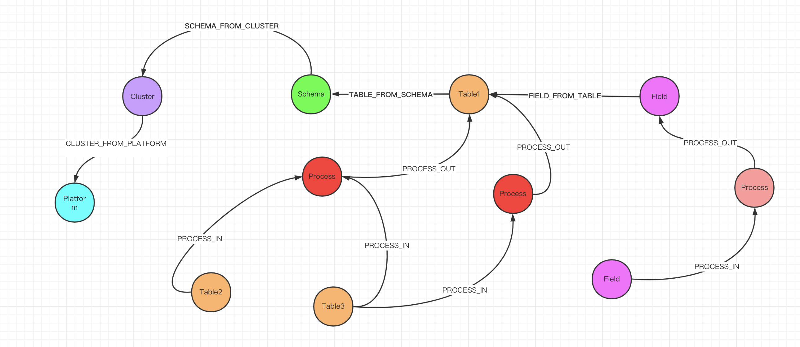
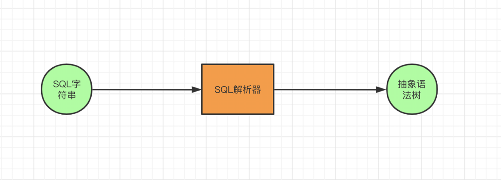
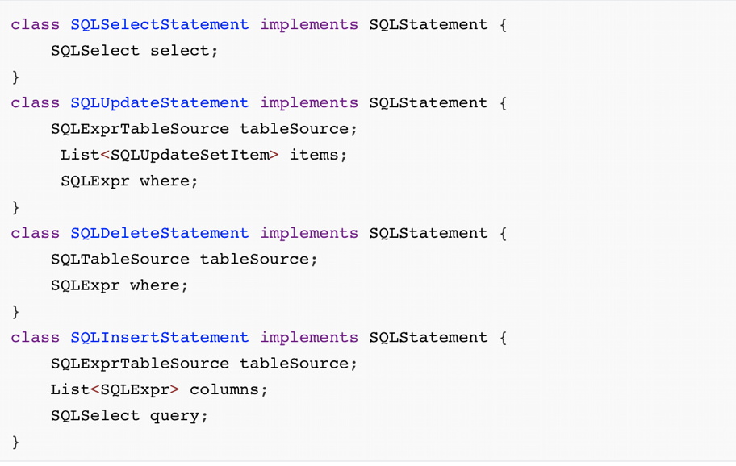
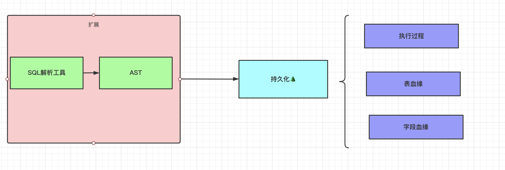
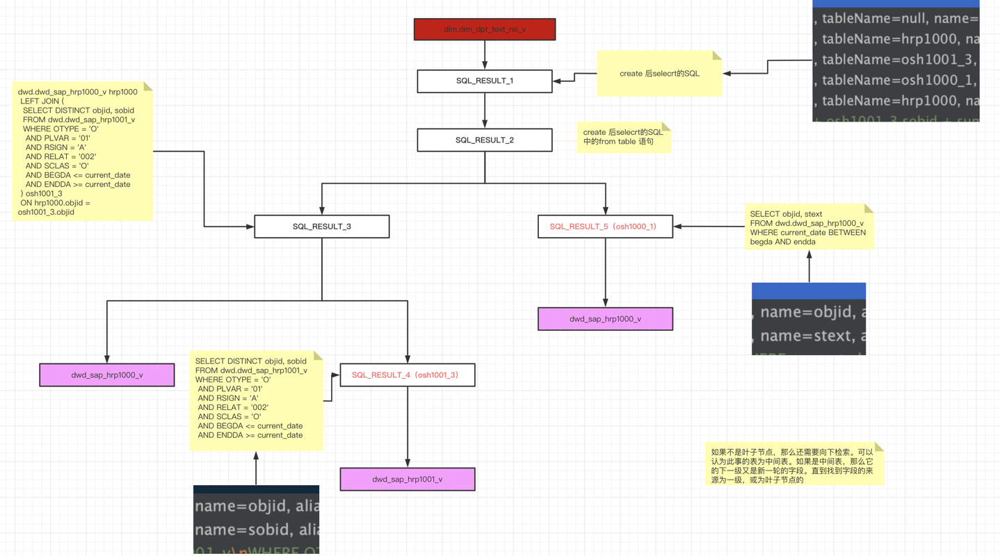

# 数据血缘

数据血缘提供多种扩展实现。本项目专注于SQL解析，目前通过Druid SqlParser 解析SQL，获取字段、表级别的血缘关系。转换成血缘模型，在图数据库neo4j上呈现。

## 整体结构


## 血缘模型



### 模型

`Platform`: 平台节点，表示所属服务平台。

`Cluster`： 集群节点，表示数据库集群，其中包含租户概念，如果以租户id_数据源编码组成，会以此作为clusterName, 指代集群代码。

`Schema`：Schema节点，表示数据库的schema。如果是catalog型的数据库，它catalog下有schema的概念，此时指代为 catalog.schema

`Table`: 表节点，表示数据库中的表。

`Filed`：字段节点，表示数据库的字段。

`Process`：过程节点，表过程节点，字段过程节点。表示字段或表的血缘流动的过程。

### 关系

`CLUSTER_FROM_PLATFORM `：集群所属平台

`SCHEMA_FROM_CLUSTER`: Schema所属集群

`TABLE_FROM_SCHEMA`： Table所属Schema

`FIELD_FROM_TABLE`： FIeld所属Table

`PROCESS_IN`： 过程输入，可看作血缘来源

`PROCESS_OUT`： 过程输出，可看作血缘影响

### 唯一索引键

唯一建组成，指定唯一性字段保证图中节点的唯一性。

`Platform`: pk, platfromName

`Cluster`： pk, platfromName/clusterName

`Schema`：pk. platfromName/clusterName/schemaName

`Table`: pk，platfromName/clusterName/schemaName/tableName

`Filed`：pk. platfromName/clusterName/schemaName/tableName/fieldName

`Process`：过程节点唯一建，取相关节点的主键进行md5生成，确保了其唯一性。


## SQL解析

#### AST

[ast](https://en.wikipedia.org/wiki/Abstract_syntax_tree)全称是abstract syntax tree，中文直译抽象语法树



  SQL解析，本质上就是把SQL字符串给解析成ast，也就是说SqlParser的入参是SQL字符串，结果就是一个ast。

#### Druid Parser 

怎么用SqlParser把SQL语句解析成ast？


如上，SQLStatement表示一条SQL语句，我们知道常见的SQL语句有CRUD四种操作，所以SQLStatement会有四种主要实现类。然后Druid的AST树进行解析生成统一的树。



#### 转换成通用的一棵树



#### 解析的例子




## 快速开始

### 安装环境

> 见下面

### 准备数据

#### 数据库

> 可以使用docker 安装一个postgresql。进行如下建表操作

```sql
CREATE TABLE test.table1(
a1 int4,
b1 int4,
c1 int4,
d1 int4
);
CREATE TABLE test.table2(
a2 int4,
b2 int4,
c2 int4
);
CREATE TABLE test.table3(
a3 int4,
b3 int4,
c3 int4,
d3 int4
);
CREATE TABLE test.table4(
a4 int4,
b4 int4,
c4 int4
);
CREATE TABLE test.table5(
a5 int4,
b5 int4,
c5 int4
);
CREATE TABLE test.table6(
a6 int4,
b6 int4,
c6 int4,
d6 int4
);
CREATE TABLE test.table7(
a7 int4,
b7 int4
);
CREATE TABLE test.table8(
a8 int4,
b8 int4,
c8 int4
);


insert into table1
select
t2.a2,
t2.b2 + t2.c2,
t3.b3+t3.c3,
t3.d3
from table2 t2,table3 t3
where t2.a2=t3.a3

insert into table2
select
t4.a4,
t4.b4 + t4.c4,
t5.b5
from table4 t4,table5 t5
where t4.a4=t5.a5
insert into table3
select
t5.a5,
t6.b6,
t6.c6,
t6.d6
from table5 t5,table6 t6
where t5.a5=t6.a6
insert into table6
select
t7.a7,
t7.b7,
t8.b8,
t8.c8
from table7 t7,table8 t8
where t7.a7=t8.a8
```


#### kafka数据

```json
{"sourceType":"SQL","dbType":"postgresql","tenantId":0,"datasourceCode":"gp","sql":"insert into table1\n\nselect\n\nt2.a2,\n\nt2.b2 + t2.c2,\n\nt3.b3+t3.c3,\n\nt3.d3\n\nfrom table2 t2,table3 t3\n\nwhere t2.a2=t3.a3","platformName":"default","clusterName":"0_gp","catalogName":"test","schemaName":"test"}
```

#### 启动项目

`lineage-main`启动项目

#### 采集结果


## 组件

### kafka

#### 安装

Kafka [docker-compose.xml]()

指定修改配置文件中`KAFKA_ADVERTISED_HOST_NAME` 为主机网卡ip


#### 配置

修改`lineage-main`中`application.yml `中`bootstrap-servers` 为 ip:9092

#### 常用命令

>  docker exec -it 容器id /bin/bash 进入后操作

**创建topic**

```shell
$KAFKA_HOME/bin/kafka-topics.sh --create --topic lineage --partitions 1 --zookeeper zookeeper:2181 --replication-factor 1
```

**查看创建的topic**

```shell
$KAFKA_HOME/bin/kafka-topics.sh --zookeeper zookeeper:2181 --describe --topic lineage
```

**生产消息**

```shell
$KAFKA_HOME/bin/kafka-console-producer.sh --topic=lineage --broker-list zookeeper:9092
```

**消费消息**

```shell
$KAFKA_HOME/bin/kafka-console-consumer.sh --bootstrap-server zookeeper:9092 --topic lineage-topic --from-beginning
```

**从头消费消息**

```shell
$KAFKA_HOME/bin/kafka-console-consumer.sh --zookeeper zookeeper:2181 --topic lineage --from-beginning
```


### neo4j

#### 安装

```shell
docker run \
    --publish=7474:7474 \
    --publish=7473:7473 \
    --publish=7687:7687 \
    --volume=$PWD/conf:/conf \
    --volume=$PWD/data:/data \
    --volume=$PWD/import:/import \
    --volume=$PWD/logs:/logs \
    --volume=$PWD/plugins:/plugins \
    neo4j:3.5.16

默认登录密码：默认`neo4j`/`neo4j` 需要修改
`localhost`:`7474`   `neo4j`/`123456`
```

#### 配置

修改`lineage-main`中`application.yml ` 中neo4j相关配置

#### 使用

[Neo4j Cypher](https://neo4j.com/docs/cypher-manual/4.1/clauses/match/)

[Spring Data ](https://docs.spring.io/spring-data/neo4j/docs/current/reference/html/)[Jpa](https://docs.spring.io/spring-data/neo4j/docs/current/reference/html/)[ Neo4j ](https://docs.spring.io/spring-data/neo4j/docs/current/reference/html/)

# TODO List
1. Kafka修改为Pulsar
2. 接入Doris审计表
